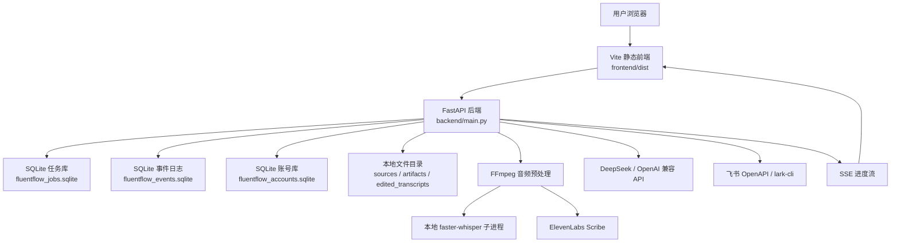
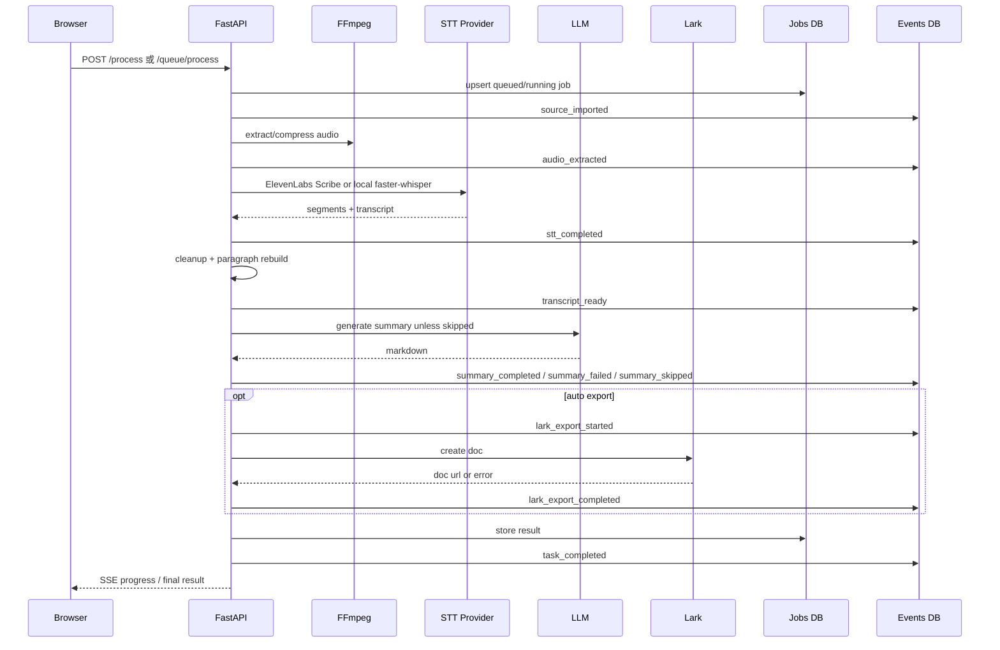
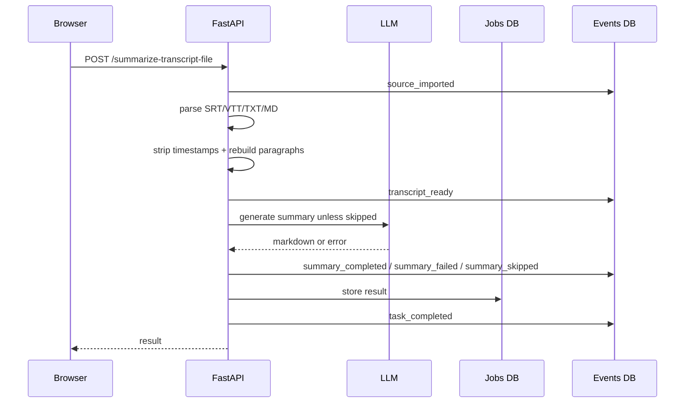

# FluentFlow 架构说明

本文档用来帮助维护者理解 FluentFlow 的系统结构。它不是完整源码说明，而是回答：

- 前端、后端、SQLite、本地文件、ElevenLabs、本地 STT、LLM、飞书之间怎么协作？
- 一个任务从上传到结果页经历哪些阶段？
- 哪些数据持久化，哪些只是运行时状态？
- 哪些地方是未来公开试用最容易出问题的边界？

## 总览



## 前端

主要文件：

- `frontend/src/app.jsx`：React 前端入口。
- `frontend/src/routes/`：页面级模块。
- `frontend/src/tailwind.css`：Tailwind 输入样式。
- `frontend/dist/`：Vite 构建后的前端页面和带 hash 的 JS/CSS。

构建命令：

```bash
npm run build:frontend
```

前端职责：

- 登录/注册或访问码输入。
- 上传音视频、字幕、链接。
- 展示历史记录、最近活动和任务状态。
- 通过 SSE 接收进度。
- 打开编辑器查看转录和摘要。
- 修改转录分段文本。
- 下载转录和摘要产物。
- 手动触发摘要重新生成和飞书导出。

前端不应该承担：

- 保存长期机密。
- 判断任务是否真正成功。
- 伪造 STT 百分比。
- 把用户行为解释为质量认可。

## 后端

主要入口：

- `backend/main.py`

关键 API：

| API | 作用 |
| --- | --- |
| `GET /` | 返回前端页面。 |
| `POST /auth/register` | 账号模式下注册。 |
| `POST /auth/login` | 登录。 |
| `POST /queue/process` | 多文件入队。 |
| `POST /process` | 单文件处理主链路，返回 SSE。 |
| `POST /summarize-transcript-file` | 字幕/文本导入并生成摘要。 |
| `GET /jobs` | 当前账号或设备作用域下的任务列表。 |
| `GET /jobs/{task_id}` | 单个任务状态和结果。 |
| `GET /jobs/{task_id}/events` | 任务进度 SSE。 |
| `PATCH /jobs/{task_id}/transcript` | 保存编辑后的转录稿。 |
| `GET /jobs/{task_id}/artifacts/{kind}` | 下载产物。 |
| `POST /regenerate-summary` | 重新生成摘要。 |
| `POST /export-lark` | 手动导出飞书。 |
| `POST /events` | 前端按钮行为事件。 |
| `GET /health` | 基础健康检查。 |
| `GET /ops/status` | 运维状态。 |

后端职责：

- 权限、账号和设备作用域判断。
- 上传限制、队列限制、每日额度和全站额度控制。
- 音频预处理。
- 本地或云端 STT。
- 文本清洗、段落重组、重复折叠。
- 摘要生成。
- 飞书导出。
- 任务历史和事件日志持久化。
- 本地文件和产物保存。

## 任务链路

### 音视频路径



### 字幕/文本路径



字幕/文本路径不会记录 `audio_extracted` 和 `stt_completed`，因为这些阶段没有真实发生。

## STT Provider

### 本地 faster-whisper

特点：

- 适合本地隐私和离线处理。
- 速度强依赖设备、模型、compute type 和冷/热启动。
- 运行在独立子进程，用户取消时可以终止。
- 第一段 segment 出现前无法给出真实音频进度，只能展示状态。

相关模块：

- `backend/core/audio_handler.py`
- `backend/core/stt_process.py`

### ElevenLabs Scribe

特点：

- 适合云服务器公开试用和长音频。
- 后端先用 FFmpeg 压缩成 MP3。
- 调用 ElevenLabs Speech-to-Text API。
- 统一转换为 FluentFlow 的 segments、transcript 和 metadata。
- 云端不返回细粒度音频百分比，因此产品只展示真实阶段。

相关模块：

- `backend/core/elevenlabs_stt.py`

### Legacy Azure Batch

Azure Batch 代码保留为 legacy 兼容和历史任务诊断路径，不再作为公开产品默认云端 STT。

相关模块：

- `backend/core/azure_stt.py`

## 数据持久化

| 数据 | 位置 | 内容 | 注意事项 |
| --- | --- | --- | --- |
| 任务历史 | `data/fluentflow_jobs.sqlite` | task_id、状态、进度、结果 JSON、metadata | 按账号或设备过滤 |
| 事件日志 | `data/fluentflow_events.sqlite` | 阶段事件、耗时、状态、错误、链接 | 不保存完整正文 |
| 账号 | `data/fluentflow_accounts.sqlite` 或 env 指定路径 | 用户、会话、角色 | 公开试用不要删除 |
| 原始源文件 | `data/sources/` | 上传音视频或链接下载结果 | 可短期保留 |
| 生成产物 | `data/artifacts/` | TXT/SRT/VTT/Markdown 等 | 用户可能会下载 |
| 编辑稿 | `data/edited_transcripts/` | 用户修改后的转录稿 | 属于用户劳动成果 |
| 修改记录 | `data/transcript_edit_records/` | 修改前后文本和上下文 | 可用于 STT 质量评估 |
| 历史快照报告 | `reports/` | localStorage/日志回溯报告 | 不等于事件日志 |

## 身份与隔离

当前有两层：

1. 账号模式：正式公开试用推荐。
2. 设备级 `client_id`：未启用账号时的低成本隔离。

区别：

| 能力 | 账号模式 | 设备级 client_id |
| --- | --- | --- |
| 跨设备找回历史 | 可以 | 不可以 |
| 清空浏览器后恢复 | 可以 | 不可以 |
| 多用户隔离 | 更可靠 | 只适合封闭 Beta |
| 适合公开推广 | 是 | 否 |

## 进度与任务恢复

FluentFlow 使用两类进度：

- 当前请求的 SSE：用于实时展示处理阶段。
- 任务库中的 job 状态：用于刷新页面后恢复任务状态。

注意：

- SSE 连接断开不等于用户取消。
- 用户点击取消才应记录取消行为。
- 后端重启会中断进程内任务；启动后会尝试恢复 queued/running 任务，但不应把它当成强一致任务系统。

## 外部服务边界

| 服务 | 用途 | 风险 |
| --- | --- | --- |
| ElevenLabs Scribe | 默认云端转录 | API Key、账户额度、网络失败、文件体量限制 |
| Azure Speech + Blob | Legacy 云端转录 | 配置复杂、SAS 过期、排队等待、网络失败 |
| DeepSeek / OpenAI | 生成结构化摘要 | 长文本漏点、模型失败、成本 |
| 飞书用户 OAuth | 以当前 FluentFlow 用户连接的飞书账号创建云文档 | OAuth 回调、用户授权、token 存储保护、权限 |
| 飞书 OpenAPI | 使用维护者或私有部署应用凭证创建云文档 | App 凭证、父文档/知识库权限、普通用户误用维护者空间 |
| lark-cli | 使用本机身份创建文档 | 登录态、PATH、权限 |

外部服务失败时，前端应该显示人能理解的错误；metadata 可以保留原始错误供维护者排查。

## 可观测性

当前已有：

- `GET /health`
- `GET /ops/status`
- 任务 SQLite
- 事件 SQLite
- STT 性能报告
- 历史快照报告
- systemd / uvicorn 日志

推荐排查顺序：

1. 前端任务状态。
2. `/jobs/{task_id}`。
3. `/ops/status`。
4. 后端日志。
5. 事件导出。
6. 外部服务 smoke test。

## 当前架构限制

- SQLite 适合小规模试用，不适合高并发 SaaS。
- 单机文件目录适合 Beta，不适合长期大规模存储。
- 本地设备级隔离不是账号系统。
- 云端 STT 等待状态无法提供本地逐段推理百分比。
- 没有完整质量反馈 UI，不能计算笔记可用率和用户评分。
- 没有支付、套餐、组织权限和完整合规体系。

## 后续演进方向

如果外部用户量上来，优先级应是：

1. 账号和历史同步稳定化。
2. 云端文件存储迁移到 OSS / Blob 等对象存储。
3. 任务队列从进程内队列迁移到更可靠的队列。
4. 增加最小质量反馈入口。
5. 增加用户级数据删除和隐私说明。
6. 用真实用户反馈和事件日志决定是否继续做多人协作、计费或团队版。
