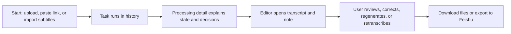

# FluentFlow Current Version Plan

Last updated: 2026-06-30

This document is the macro plan for the current FluentFlow version cycle. It is
not a release tag and does not replace `VERSION`.

## Version Goal

Make FluentFlow a reliable single-user workflow for turning course, lecture,
video-link, audio, and subtitle materials into editable learning notes.

The current version is successful when a user can:

1. Import a supported material.
2. See where the long-running task is and why it is there.
3. Open a stable result with transcript, note, and artifacts.
4. Fix or regenerate when language, transcription, or note generation is wrong.
5. Download or export the result without understanding internal provider details.

## Product Boundary

### In This Version

- Video/audio upload to transcript and note.
- Supported video-link ingestion with platform-specific reliability rules.
- Subtitle/text import to note.
- History records, task status, failure diagnosis, retry, delete, and recovery.
- Editor review for transcript, note, source media, regeneration, retranscription,
  and export.
- Feishu export as the primary external-document route.
- Local and account-backed execution states that are visible and understandable.

### Not In This Version

- Full team collaboration, organization permissions, or SaaS billing.
- General knowledge-base management.
- Professional subtitle production, styling, timing, and publishing workflows.
- Broad export expansion such as Notion or Obsidian unless the core Feishu and
  local download routes are already stable.
- Unsupported platform promises. Do not show TikTok, Xiaohongshu, or other
  platforms as supported before their ingestion path is real.
- Cosmetic Agent theater that is not backed by real task state, decisions, or
  tool execution.

## Primary User Path

Every current-version task should improve one part of this path. If it does not,
it should usually wait.

## Priority Phases

### Phase 1: Task State And History Stability

Status: in progress

Goal:

- Make home, history, processing detail, and editor describe the same task state.

Done when:

- Recent activity and history records read the same source of truth.
- Processing detail shows current step, failure reason, next action, and outputs.
- Failed and cancelled tasks can be retried or deleted where the backend allows.
- Old task records remain readable through compatibility fields.

Main references:

- `docs/task_status_model_unification_plan.md`
- `docs/workflow_design_system.md`
- `docs/result_schema.md`

### Phase 2: Editor Review Loop

Status: next

Goal:

- Make the result editor good enough for real correction and reuse.

Done when:

- Title, metadata, and action buttons are compact and readable.
- Transcript rows align well with timestamps and source playback.
- Video review works when source media is retained, with clear retention rules.
- Users can regenerate notes, retranscribe with corrected settings, and export
  transcript/note/media artifacts from one place.
- Missing source media is explained as a retention or permission state, not a
  mysterious disabled tab.

Main references:

- `docs/ui_design_system.md`
- `docs/workflow_design_system.md`
- `docs/result_schema.md`

### Phase 3: Platform Link Ingestion Reliability

Status: not started

Goal:

- Treat each video-link platform as a separate ingestion strategy instead of a
  generic URL downloader.

Done when:

- Douyin, Bilibili, and any other supported platform have documented capability
  boundaries.
- Unsupported content types are rejected with plain-language reasons.
- Link tasks do not stay stuck at early progress without diagnosis.
- Downloaded source files have a clear retention and cleanup policy.

Main references:

- `docs/video_link_crawl_test.md`
- `docs/operations_runbook.md`
- `docs/event_logging.md`

### Phase 4: Note Quality And AI Planning

Status: not started

Goal:

- Improve note quality from real materials and make AI planning explainable.

Done when:

- Real course/lecture samples are evaluated for missed concepts, weak structure,
  hallucinated details, and poor bilingual handling.
- Prompt, chunking, and note-mode changes are driven by observed failures.
- AI planning records user-visible decisions and evidence without exposing raw
  inner monologue.
- Transcript-only, direct note, and high-fidelity note routes have clear
  selection reasons and fallback behavior.

Main references:

- `docs/note_mode_evaluation_plan.md`
- `docs/long_transcript_coverage_notes_plan.md`
- `docs/result_schema.md`

### Phase 5: Export, Storage, And Public Beta Readiness

Status: not started

Goal:

- Make results portable and make the product safe to open to more users.

Done when:

- Feishu has two clear export routes: product app export and local identity
  export.
- Local downloads cover transcript, subtitle, note, and retained media where
  available.
- Environment setup, privacy boundary, runtime data, and deployment recovery are
  documented without private information.
- The public README, usage guide, and deployment docs describe the same current
  product.

Main references:

- `docs/operations_runbook.md`
- `docs/usage_guide_cn.md`
- `docs/product_overview.md`
- `README.md`

## Execution Rule

Do not implement this whole plan in one conversation.

For every future execution:

1. Pick exactly one phase and one concrete outcome inside that phase.
2. If the outcome spans backend, frontend, docs, and tests, create or update a
   narrow staged plan first.
3. Execute one stage, validate it, update the relevant plan status, then stop.
4. Do not move to the next phase just because the user says "continue" unless
   the current phase stop condition has been met.

## Current Recommendation

Finish Phase 1 first, then move to Phase 2.

Reason:

- Task status and history are the foundation for every long-running workflow.
- The editor depends on stable task/result/artifact state.
- Platform ingestion and note quality work are harder to judge while task state
  is still inconsistent.
