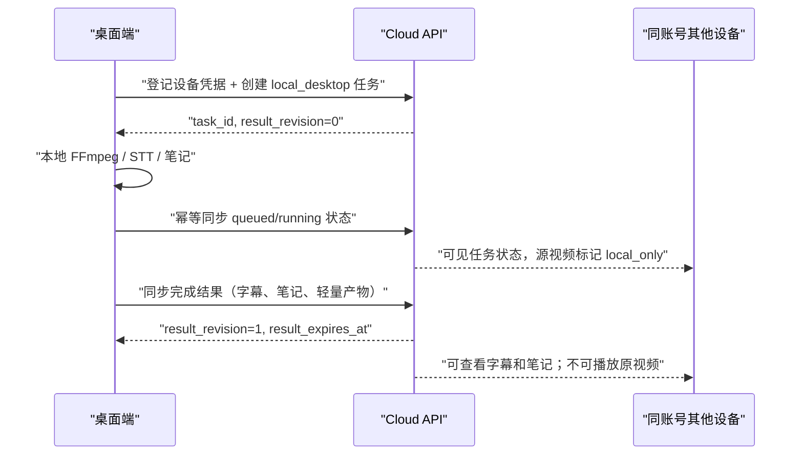

# FluentFlow 本地执行结果云端同步契约

状态：阶段 1C 本地同步传输与状态 UI 已完成；阶段 1D 跨设备只读阅读已完成，2026-07-20

关联路线图：`docs/hybrid_saas_execution_roadmap.md`。

本文是第一版“桌面本地 STT + 云端同步结果”的实现契约。它只定义数据、权限、状态和验收，不改变
现有处理流水线、上传路由、Google OAuth 配置或云端转录。阶段 1 的每个代码工作单元必须遵守本文。

## 一、第一版边界

第一版只支持以下路径：

1. 用户从 Windows / macOS 桌面启动器打开 FluentFlow。
2. 桌面端在本机读取源视频，使用 FFmpeg 和本地 STT 完成转录。
3. 桌面端将任务状态、字幕、笔记、用户编辑和轻量产物同步到云端账号。
4. 同账号的另一台设备可以查看同步后的任务、字幕和笔记。
5. 原视频仍只在处理它的设备播放，云端必须明确说明该限制。

第一版不做：网页唤起桌面执行、桌面抽音频后云端 STT、原视频上传 OSS、跨设备原视频播放、团队共享、
支付或组织权限。已有线上域名云端转录继续按现有流程运行，不纳入本次改造。

## 二、已验证的现状与缺口

当前实现提供以下基础：

- 账号模式下，任务以 `client_id = user:<account_id>` 归属账号；同一账号的云端任务已经能跨浏览器读取。
- Google OAuth 已有授权、回调和会话创建路径。
- Result Payload v2 已能保存逐字稿、分段字幕、笔记和轻量导出产物。
- 本地源文件默认有 7 天保留能力，但只对当前运行环境的本地目录生效。

当前缺口：本地启动器和云端是两个独立运行环境。本地 `task_id`、本地会话、文件路径和产物 URL 不能
直接写入云端；现有 `/jobs`、`/process` 和已删除的云工作区代理都不能承担安全的结果同步。

## 三、不变原则

1. **账号拥有结果，设备拥有原视频。** 云端账号是任务、字幕、笔记与编辑结果的事实源；桌面设备
   只拥有源文件和本地处理临时数据。
2. **执行位置独立于 STT provider。** `local_desktop` 表示在哪里执行，不等同于 `local` 或
   `elevenlabs_scribe` 等 provider 名称。
3. **云端不接收本地路径或原视频。** 同步请求不得包含绝对路径、目录结构、原视频字节、原视频
   artifact URL 或可用于推断本机文件系统的信息。
4. **同步是显式的。** 桌面端只向云端的专用同步 API 发送允许的数据；不得恢复“把本地全部请求
   转发到云端”的旧代理模式。
5. **写入可重试但不能重复。** 网络中断、应用重启和重复提交不得创建第二个云端任务、重复扣费或
   覆盖较新的编辑。

## 四、身份与设备

### 4.1 账号登录

Google OAuth 是新用户的首选登录入口。桌面端通过浏览器完成云端 Google OAuth 后，云端必须为该桌面
安装签发一个可撤销、可过期、仅限同步 API 的设备凭据。

不得把云端 Web 会话 cookie 当作长期桌面凭据，也不得要求用户复制云端 session token 到本地配置。
现有 API key 机制可以作为实现参考，但阶段 1 应提供设备用途、创建时间、最近使用时间和撤销能力，
不能将通用 API key 静默当作设备身份。

### 4.2 设备记录

云端记录最小设备信息：

| 字段 | 规则 |
| --- | --- |
| `device_id` | 云端生成的随机 ID，不使用 MAC 地址或本机路径 |
| `account_id` | 设备只属于一个 FluentFlow 账号 |
| `display_name` | 用户可见的设备标签，例如“Yuchao 的 Mac”；可修改 |
| `platform` | `macos` 或 `windows` |
| `created_at` / `last_seen_at` | 用于安全审计和设备管理 |
| `revoked_at` | 撤销后立即拒绝同步，保留最小审计记录 |

设备撤销不删除该账号已同步的任务结果，也不删除设备上的本地文件。

## 五、任务与源文件模型

每个同步任务至少具有以下稳定语义：

| 概念 | 第一版规则 |
| --- | --- |
| `task_id` | 桌面端先生成随机 UUID，云端首次登记时校验并持久化同一 ID；这样网络暂时不可用时，本机仍可先完成转录并在恢复后安全补登记，无需双 ID 映射 |
| `owner_account_id` | 云端认证账号；对应现有 `client_id = user:<account_id>` 访问边界 |
| `execution_location` | 固定为 `local_desktop`；后续才可能增加 `cloud`、`connected_desktop` |
| `origin_device_id` | 创建和运行本任务的桌面设备 |
| `source_availability` | 第一版为 `local_only`；后续可增加 `cloud_available`、`external_url`、`unavailable` |
| `source_file_available` | 仅表示当前执行环境能否播放，不可被云端误读为跨设备可下载 |
| `result_revision` | 从 1 开始递增的云端结果版本，用于原处理设备的同步重放和旧副本检测 |
| `result_expires_at` | 在任务首次完成时固定为完成时间加 7 天；编辑、查看或重试不能延长它 |

云端可存 `source_filename`、时长、文件大小和用户可见标题，但不能存 `source_path`、本地 artifact URL、
本地 IP、MAC 地址或本地目录结构。

## 六、同步生命周期

### 6.1 任务登记

桌面端在开始处理前持久化一个随机 `task_id`、用户可见源元数据和随机 `idempotency_key`。有网络时立即
登记；断网时先在本机 outbox 保留同一登记请求，恢复后再发送。云端以“账号 + device + idempotency key”
去重并持久化该稳定 `task_id`，初始 `result_revision = 0`。

桌面端随后将该 `task_id` 交给现有本地处理路径。若本地处理在登记后未能开始，桌面端必须同步明确的
`failed` 或 `cancelled` 状态，不能留下一条永久 `queued` 记录。

### 6.2 状态同步

桌面端可多次提交 `queued`、`running`、`completed`、`failed` 或 `cancelled` 状态。每个请求都带：

- `task_id`
- `device_id`
- `operation_id`（每次状态 / 结果写入唯一）
- `base_revision`
- 当前状态、阶段、可测量进度和用户可见错误码

云端保存已处理的 `operation_id`。同一个操作重复到达时返回第一次的成功结果，不产生重复任务、重复
事件或重复额度记录。第一版本地 STT 不应在云端产生 STT 计费；同步端点禁止调用云端处理队列。

### 6.3 完成结果同步

完成同步只接收 Result Payload v2 的可迁移内容：

- `transcript_text`、`raw_segments`、`display_segments`
- `summary_markdown`、笔记状态和用户编辑标记
- 标题、语言、时长、处理决策和失败诊断
- 可由云端重新生成的 TXT / SRT / VTT / Markdown 轻量产物

桌面端不得上传原视频、播放音频、原始关键帧、`artifacts.*.url`、`source_file_storage` 或本地文件路径。
云端根据同步的 canonical result 生成自己的轻量产物和下载 URL；不能保留桌面端 URL。

## 七、编辑与冲突

第一版不是协同编辑产品。为控制状态和数据风险，本地执行任务采用单写入者规则：

1. 本地任务 `running` 时，其他设备仅查看状态和已同步内容，不能编辑正在写入的结果。
2. 任务 `completed` 后，其他设备可阅读、下载字幕和笔记，但不能编辑 `local_desktop` 任务。
3. 只有 `origin_device_id` 对应的桌面端能继续编辑并同步结果；每次写入携带 `base_revision`。
4. 云端版本不一致时返回 `409 conflict` 和最新摘要；桌面端必须刷新后再提交，不能静默覆盖。
5. 跨设备编辑与逐字符合并属于后续阶段，不能混入第一版。

## 八、保留、删除与撤销

| 数据 | 生命周期 |
| --- | --- |
| 云端任务、字幕、笔记、轻量产物 | 任务首次完成后 7 天；到期后清理内容、产物和索引 |
| 本地原视频和本地运行数据 | 由本机保留策略决定；云端任务或账号删除不触碰 |
| OSS 原视频 | 不属于第一版；后续主动上传成功后保留 7 天 |
| 账号删除 | 申请后立即停止任务与设备同步，进入 7 天可撤销窗口；同一 Google 身份可重新认证并仅进入撤销流程，清理任务执行前允许撤销，期满不可逆清除 |

清理任务必须幂等、可审计，并先撤销下载与同步权限，再删除内容。`result_expires_at`、账号删除申请时间和
`purge_after` 必须使用服务端时间生成，不能信任桌面时钟。

## 九、推荐 API 边界

以下是阶段 1 的产品 API 形状，不要求沿用具体路由名：

| 能力 | 最小语义 |
| --- | --- |
| 设备注册 / 撤销 | Google 登录后的桌面设备领取、列出和撤销；返回受限设备凭据 |
| 创建本地任务 | 建立 `local_desktop` 云端任务，分配 `task_id` 和初始 revision |
| 同步任务状态 | 按 `operation_id` 幂等写入阶段、进度、失败或取消状态 |
| 同步完成结果 | 以 `base_revision` 写入 canonical Result Payload v2，并生成云端轻量产物 |
| 读取任务与结果 | 沿用账号归属的任务读取；响应必须带执行位置、源文件可用性、设备标签和到期时间 |
| 账号删除 / 撤销 | 创建、查看、撤销删除申请；清理任务按 `purge_after` 运行 |

这些是 Agent-actionable 工作流。实现时要更新 Agent Task Package，至少暴露执行位置、源文件可用性、
结果到期时间和可执行的下载 / 恢复建议；MCP 只需在现有读取任务包、等待、诊断工具上扩展字段，除非
外部 Agent 需要实际发起桌面同步。

1A 的设备登记和撤销刻意不提供 Agent API 或 MCP 工具：它会签发或销毁长期桌面凭据，必须由已登录的
账号会话直接确认。1B 开始产生可跨设备读取的任务字段时，才扩展 Agent Task Package；MCP 继续使用既有
任务读取工具，无需新增可签发设备身份的工具。

当前 1B 已使用专用 `/desktop-sync/v1` API：它只接受桌面设备凭据、只允许任务的 origin device 写入，
并把 `execution.location`、`source_availability`、origin device 标签、`result_revision` 和
`result_expires_at` 投影到 Agent Task Package。该 API 不会进入云端处理队列，也不接受原视频或本地路径。

## 十、迁移与兼容

1. 现有 `cloud` 任务、local-only 历史和旧 Result Payload v2 必须继续可读。
2. 新字段必须有保守默认：未知执行位置显示为现有行为，未知源可用性不承诺可播放。
3. 同步元数据、幂等操作记录和设备记录不能只塞进无版本的 `metadata_json`；实现必须选择带迁移、索引和
   清理策略的显式持久化结构。
4. 不修改既有任务 ID、账号 ID 或本地源文件目录布局；需要迁移时保留回滚和旧数据读取路径。
5. 同步 API、Job Payload、Result Payload 和 Agent Task Package 发生持久化变化时必须同步更新 schema 文档、
   测试和 `docs/changelog.md`。

## 十一、阶段 1 工作单元与验收

| 工作单元 | 主要表面 | 结束条件 |
| --- | --- | --- |
| 1A. 云端设备凭据 | account auth、设备存储、撤销 API、测试 | 已完成：设备只能代表自己的账号，撤销后立即失效 |
| 1B. 云端同步任务存储 | job schema / sync receipts、结果 schema、Agent Package、测试 | 已完成：重放同一操作不会创建重复任务或覆盖新 revision |
| 1C. 桌面同步客户端 | 本地配置、任务提交、离线重试、状态 UI | 已完成：本机凭据、浏览器配对、任务登记、状态/结果 outbox 重试，以及用户可见状态和手动重试入口 |
| 1D. 跨设备阅读 | 任务列表、编辑器、source availability 文案、测试 | 已完成：第二台桌面会先尝试本机副本，未命中时打开云端结果；明确显示原视频仅在处理设备，并拒绝跨设备修改、重转或重试 |
| 1E. 7 天清理与账号删除 | 保留任务、删除 / 撤销 API、后台清理、运维测试 | 到期清理可重试；删除窗口内可撤销，期满不可恢复 |

阶段 1 完成前必须通过：

- 同账号两台设备：桌面本地处理一条视频，另一设备看到同一字幕和笔记。
- 不同账号：猜测 `task_id` 不能读取、同步或下载任何结果。
- 网络中断：至少一次状态和一次完成结果同步可安全重放。
- 冲突：原处理设备使用旧 revision 同步时得到 `409`，不覆盖新版；其他设备不能编辑本地执行任务。
- 隐私：请求、任务库和 Agent Task Package 中不含本地绝对路径或原视频字节。
- 保留：服务端到期时间不因查看或编辑延长；清理后不能下载内容。
- 解冻闸门：本地转录与既有云端转录各连续三次完成“导入 -> 转写 -> 笔记 -> 导出”的人工验收。

## 十二、当前停止条件

阶段 0 的设计输出和地基稳定化验收均已完成。阶段 1 仍必须按工作单元单独实现、验证、提交和审查；
1A–1D 已完成。跨设备编辑仍未开放；设备状态与手动重试已经在本机设置页提供。
