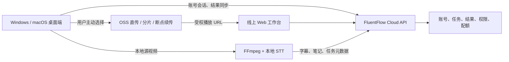

# FluentFlow 混合执行与正式 SaaS 路线图

状态：提案，2026-07-16

本路线图定义 FluentFlow 从单机 / 单台云服务器 Beta 演进为正式 SaaS 的路径。它不改变
`docs/current_version_plan.md` 的当前版本范围，也不意味着立即启动新功能开发。

开始前必须通过 `docs/foundation_stabilization_plan.md` 的解冻闸门：用真实材料分别完成本地
转录和云端转录的“导入 -> 转写 -> 笔记 -> 导出”端到端人工验收。后续每个阶段单独开工作单元，
不跨阶段顺手实现。

## 一、产品判断

长视频的原始文件通常很大。把所有源视频默认上传到云端，会把产品体验建立在用户上行带宽、云端
磁盘和单机处理能力之上，不适合 FluentFlow 的核心场景。

目标形态是“一个云端账号，多个执行端”：

- 桌面启动器打开：本机可以读取源视频、运行 FFmpeg 和本地转录；原视频默认留在本机。
- 线上域名打开：浏览器只能调用云端能力；要处理或播放本地文件，必须上传相应文件，或显式交给
  已连接的桌面端处理。
- 云端账号：保存任务索引、字幕、笔记、编辑结果、轻量产物和跨设备可见的状态。
- OSS：只在用户主动要求跨设备播放原视频时保存原视频；采用客户端直传、分片和断点续传，不能让
  FluentFlow 应用服务器中转大文件。

这不是把已删除的“云工作区代理”恢复回来。旧代理会把本地上传静默转发到云端；新模型必须让执行
位置、数据去向和同步内容对用户可见且可控。

## 二、已确认的产品决策

以下决策由产品负责人于 2026-07-16 确认，后续设计和实现不得与之冲突：

- **登录首选**：新用户主推 Google OAuth 登录。现有邮箱 / 密码入口不再作为主路径；是否作为兼容
  备用入口保留，由阶段 0 在迁移、找回账号和支持成本评估后单独决定。
- **云端结果保留**：云端的字幕、笔记、任务元数据和轻量产物默认自任务完成起保留 7 天。产品必须在
  任务详情和列表中展示到期时间，并在清理前提供下载 / 导出提示；这不是永久云端笔记库。
- **账号删除**：用户请求删除账号后，云端账号数据进入 7 天清除期，并在期满后彻底清除。删除云端
  数据不能删除用户设备上的源视频或本地运行数据。
- **原视频默认本地**：原视频不随结果同步；只有用户主动选择跨设备播放时才上传 OSS。

仍待阶段 0 明确的边界包括：7 天清除期内是否允许撤销账号删除、OSS 原视频的默认保留期，以及
阿里云中国区是否为最终云端部署与数据驻留方案。

## 三、入口与能力矩阵

| 用户入口 | 可选执行方式 | 原视频播放 | 云端可见内容 |
| --- | --- | --- | --- |
| 桌面启动器 | 本地 STT；或本地抽音频后云端 STT | 不上传即可在本机浏览器播放 | 任务状态、字幕、笔记、编辑结果、轻量产物（默认保留 7 天） |
| 线上域名，未连接桌面端 | 云端音频 / 视频处理 | 必须上传源视频后才能播放 | 云端任务及其全部云端产物 |
| 线上域名，已连接桌面端 | 用户确认后由指定桌面端执行；或云端处理 | 本机视频只在该设备播放；跨设备播放须上传 | 与桌面端相同的结果与状态 |

线上网页不能直接读取用户电脑文件、运行 FFmpeg 或调用本地模型。这是浏览器权限边界，不是前端
功能缺失。网页交给本机处理需要后续的桌面 Companion / 本地服务握手，并且每次任务都需用户确认。

## 四、目标架构

云端的事实源是账号、云端任务记录和可跨设备使用的结果；本地事实源是该设备持有的原视频及其本地
路径。云端只能记录“源视频在某设备可用 / 已上传 / 不可用”，绝不能把本地绝对路径同步到云端。

## 五、路线与验收

| 阶段 | 目标与范围 | 结束条件 | 预估（单名全职工程师） |
| --- | --- | --- | --- |
| 0. 解冻与契约 | 完成当前地基计划人工验收；定义任务归属、执行位置、源文件可用性、同步幂等、冲突、取消、重试、删除和保留策略 | 有评审过的 API / 数据契约和验收样例；明确 Google 登录、7 天结果保留和账号删除清除期；不改用户流程 | 3-5 个工作日，外加当前解冻验收 |
| 1. 本地执行结果同步 MVP | 桌面端以云端账号登录；本地处理后同步任务状态、字幕、笔记与编辑结果；原视频标记为“仅处理设备可用” | 两台设备登录同一账号可查看同一任务与结果；另一设备不会把无原视频误报为失败 | 3-5 周 |
| 2. 云端入口收敛 | 线上域名的任务始终走云端处理；明确上传、处理、播放和保留提示；统一桌面与网页任务状态表达 | 网页端不再出现“选择本地转录”这类不可执行承诺；长任务有明确失败与恢复语义 | 2-3 周 |
| 3. 压缩音频云端 STT | 桌面端本地 FFmpeg 抽取压缩音频；展示体积、上传与隐私提示；用户确认后直传音频供云端 STT | 2-3 小时视频不上传原片也可使用云端 STT；失败可重试，原片不离开设备 | 2-4 周 |
| 4. 网页唤起桌面执行 | 网页发现已安装且已登录的桌面服务；通过深链接或受控本地服务让用户选择设备并确认执行 | 网页可将任务明确交给当前电脑；不能静默读取文件、启动处理或绕过账号权限 | 3-5 周 |
| 5. 可选 OSS 跨设备播放 | 原视频采用签名直传、分片、断点续传、校验、访问控制和生命周期清理；播放器使用短时授权 URL | 用户主动上传后才跨设备播放；未上传时始终保留本地可用说明 | 4-6 周 |
| 6. 正式 SaaS 运行底座 | 从单机 SQLite / 进程内队列演进到托管关系数据库、可靠任务队列、对象存储、备份恢复、监控告警、数据删除与配额体系 | 可横向扩展；长任务重启恢复可预期；完成故障、备份和删除演练 | 5-8 周 |

阶段 1 是最小可用的跨设备价值，阶段 3 和 5 均可选，但不能跳过阶段 0、1 和 6 的基础契约与
可靠性工作。

## 六、阶段 0 必须产出的契约

阶段 0 只做设计和可验证样例，不能直接编码。至少明确：

1. **任务身份**：一个稳定的云端任务 ID 如何关联本地执行实例；重复同步不能创建重复任务或重复扣费。
2. **执行位置**：至少区分 `local_desktop`、`cloud` 和未来的 `connected_desktop`；它不是 STT provider 的别名。
3. **源文件状态**：至少区分 `local_only`、`cloud_available`、`external_url`、`unavailable`；不上传本地路径和原始文件名以外的敏感路径信息。
4. **同步内容**：状态、进度阶段、转录、笔记、用户编辑、可下载轻量产物和失败诊断；原视频与本地临时文件默认排除。
5. **冲突与离线**：本地断网期间可完成哪些工作，何时重试，编辑冲突如何显示和解决。
6. **隐私与删除**：任务完成 7 天后的云端结果清理；用户发起账号删除 7 天后的彻底清除；本地源文件如何保持不受影响；OSS 文件何时过期或彻底删除。
7. **配额与计费边界**：本地 STT、云端 STT、云端存储和原视频托管应分别计量；不能把本地算力消耗伪装成云端额度。

任务、结果和 Agent Task Package 的 schema 发生变化时，同一工作单元必须同步检查
`docs/agent_mcp_parity.md`，保证 Agent API 与 MCP 能提交、等待、读取和诊断新任务状态。

## 七、正式 SaaS 的非功能前置项

当前单台 ECS + SQLite + 本地目录适合 Beta，不能直接等同于正式 SaaS。阶段 6 至少需要：

- 托管关系数据库，替代云端多实例下的 SQLite 写入边界。
- 可恢复的后台队列和 worker，不把长转录绑定在单个 Web 进程中。
- 对象存储、生命周期策略、加密、签名 URL、下载审计和成本上限。
- Google OAuth 为首选的账号会话、设备登记 / 撤销、登录风险控制、限流、配额账本和支付前的用量统计。
- 日志、指标、告警、备份、恢复演练、迁移与回滚方案。
- 用户数据导出、7 天云端结果保留、账号删除后 7 天彻底清除、隐私说明和客服排障边界。
- 供应商故障降级：STT、LLM、OSS 任一不可用时的任务状态、重试和用户说明。

计费、团队协作、组织权限和高级运营后台不在跨设备 MVP 内。先证明个人账号在多设备间可靠地查看和
继续学习结果，再决定是否扩展这些商业功能。

## 八、首个执行工作单元

名称：`design: define hybrid execution sync contract`

范围：只读审查现有账号、任务、结果、源文件和 Agent API；输出同步协议、状态图、数据字段、权限
边界、失败矩阵、迁移计划和测试清单。不得修改处理流水线、上传路由、账号数据或线上部署。

成功标准：维护者能用该契约拆分阶段 1 的后端、桌面、网页和测试任务，且能明确回答“这条任务在哪里
执行、哪些数据同步、另一台设备为什么不能播放原视频”。

## 九、总体排期与决策点

在当前基础稳定化验收完成后，阶段 0-3 的最小跨设备学习结果能力预计需要 **8-17 周**；加入网页
唤起本地处理、OSS 跨设备播放和正式 SaaS 运行底座，顺序串行估计为 **17-31 周**。这是单名全职
工程师、现有产品继续维护的保守区间；两名能独立处理客户端和云端基础设施的工程师可以并行部分工作，
但账号、任务契约和数据迁移仍须由一个 owner 收敛。

启动阶段 0 前需由产品负责人确认：

1. 首期跨设备 MVP 是否只支持“桌面本地 STT + 云端同步结果”。
2. 云端部署、对象存储和数据驻留是否确定采用阿里云中国区。
3. OSS 原视频跨设备播放的默认保留期，以及账号删除清除期内是否允许用户撤销删除。
