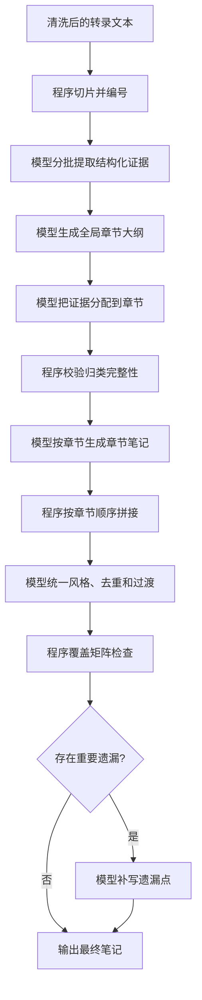

# 长字幕完整覆盖笔记生成落地方案

本文档记录 FluentFlow 下一代长字幕笔记生成方案。目标不是继续微调提示词，而是把“长字幕不漏重点”拆成可追踪、可校验、可逐步实现的产品和工程流程。

## 当前落地状态

截至当前版本，第一版 `chapter_coverage` 已接入主摘要链路，并在工作台作为“完整覆盖笔记”手动模式提供。

已落地：

- 结构化证据提取。
- 章节大纲生成。
- 证据归类到章节，未被模型分配的证据会按原顺序补入最后章节，避免静默丢失。
- 按章节生成笔记。
- 轻量合并和覆盖检查。
- 摘要结果和事件 metadata 记录切片数、证据数、章节数和高重要性证据覆盖数。

暂未落地：

- 自动模式目前由策略 Agent 推荐具体模式；阈值仍需离线评测校准。
- 中间 JSON artifact 持久化。
- 离线评测脚本和阈值校准。
- 普通用户可视化证据矩阵。

## 背景问题

当前 FluentFlow 已有“高保真笔记”模式：

- 约 2 万字符以内直接生成。
- 超过阈值后分段提取证据。
- 汇总证据生成终稿。
- 在输入长度允许时做覆盖率检查并补漏。

这比直接把长字幕一次性交给模型稳定，但仍有几个问题：

- 证据清单过长时仍需要压缩，压缩过程可能丢信息。
- 覆盖检查不是永远执行，越长的材料越容易因为输入过长跳过检查。
- 证据没有稳定 ID，无法准确知道哪些关键点进入了最终笔记。
- 最终笔记一次生成整篇，结构由模型临场组织，容易出现章节不均、重复或局部遗漏。

## 目标

把长字幕笔记生成改成“证据 ID + 章节归类 + 按章生成 + 覆盖矩阵”的工作流。

用户价值：

- 长课程、长会议、信息密集字幕更不容易漏重点。
- 最终笔记结构更像人工整理，而不是字幕切块拼接。
- 可以解释“哪些内容被覆盖了，哪些内容可能遗漏”。
- 失败或重跑时可以只重跑相关章节，减少成本和等待。

维护价值：

- 质量问题可以定位到证据提取、章节归类、章节写作或最终合并中的某一步。
- 事件日志可以记录分段数、证据数、章节数、覆盖率等指标。
- 后续可以构建真实的长字幕质量评测，而不是只看摘要是否成功返回。

## 非目标

第一版不做：

- 不做向量数据库或复杂知识库检索。
- 不做多人协作式人工审稿。
- 不保证 100% 覆盖所有字幕句子。
- 不把所有低价值口头禅、重复句都写入笔记。
- 不默认展示完整证据矩阵给普通用户，避免增加认知负担。

第一版追求的是：重要证据可追踪，高重要性遗漏可发现，章节生成更稳定。

## 核心流程



## 步骤设计

### 1. 字幕切片和编号

执行者：程序。

输入是当前已经清洗和段落重组后的转录文本。程序按稳定规则切成片段，并生成 ID。

示例：

```json
{
  "segment_id": "S001",
  "order": 1,
  "start_time": "00:00:12",
  "end_time": "00:01:03",
  "text": "原文片段..."
}
```

规则：

- 优先沿用已有字幕段或转录段。
- 如果文本过长，按段落和长度切分。
- 片段 ID 必须稳定，同一份输入重复运行时尽量保持一致。
- 程序只负责机械切片，不判断内容价值。

### 2. 分批提取证据

执行者：模型。

不是每个字幕片段调用一次模型，而是按批次调用，例如每批约 6000 到 9000 字符。

模型输出结构化证据：

```json
{
  "evidence_id": "E001",
  "source_segment_ids": ["S001", "S002"],
  "type": "concept",
  "text": "用户增长遇到瓶颈的原因是...",
  "importance": 4,
  "keywords": ["用户增长", "瓶颈"],
  "quote": "可选，保留原文关键句"
}
```

证据类型建议：

| 类型 | 含义 |
| --- | --- |
| `concept` | 概念、定义、术语。 |
| `argument` | 观点、判断、结论。 |
| `method` | 方法、步骤、框架。 |
| `example` | 案例、类比、故事。 |
| `metric` | 数字、条件、限制。 |
| `action` | 行动项、建议、决策。 |
| `detail` | 容易被漏掉但有价值的细节。 |

重要性建议使用 1 到 5：

- 5：缺失会明显影响笔记完整性。
- 4：重要章节内容。
- 3：有价值但可压缩。
- 2：背景或补充信息。
- 1：低价值，可在最终笔记中省略。

### 3. 生成全局章节大纲

执行者：模型。

输入不是完整字幕，而是证据的压缩视图：

- evidence_id
- text 摘要
- type
- importance
- source order 范围

输出：

```json
[
  {
    "chapter_id": "CH01",
    "title": "问题背景",
    "purpose": "交代材料讨论的问题和上下文",
    "order": 1
  },
  {
    "chapter_id": "CH02",
    "title": "方法框架",
    "purpose": "整理核心方法、步骤和判断标准",
    "order": 2
  }
]
```

原则：

- 章节由内容主题决定，不由字幕切片决定。
- 章节数不宜过多，默认 4 到 8 个。
- 章节标题要适合最终笔记，不使用“第 1 批字幕”这类技术标签。

### 4. 证据分配到章节

执行者：模型 + 程序校验。

模型输入章节列表和证据列表，输出 evidence 到 chapter 的映射：

```json
[
  {
    "evidence_id": "E001",
    "chapter_id": "CH01",
    "reason": "该证据说明问题背景"
  }
]
```

程序校验：

- evidence_id 是否都存在。
- chapter_id 是否都存在。
- 高重要性证据是否全部分配。
- 是否出现未分配证据。
- 是否出现重复分配。

默认第一版采用单章节归属。未来可允许一条证据属于多个章节，但需要防止重复写入。

### 5. 按章节生成笔记

执行者：模型。

每章单独调用一次。输入该章节的证据包，而不是原始连续字幕块。

输入结构：

```json
{
  "chapter": {
    "chapter_id": "CH02",
    "title": "方法框架"
  },
  "evidence_items": [
    {
      "evidence_id": "E003",
      "type": "method",
      "importance": 5,
      "text": "..."
    }
  ]
}
```

输出章节 Markdown，并在内部保留使用过的 evidence_id：

```json
{
  "chapter_id": "CH02",
  "markdown": "## 二、方法框架\n\n...",
  "used_evidence_ids": ["E003", "E004", "E008"]
}
```

产品上最终不一定展示 evidence_id，但内部必须保留，便于覆盖检查。

### 6. 合并、去重和统一风格

执行者：程序 + 模型。

程序先按 chapter order 拼接章节 Markdown。

模型再做轻量统一：

- 标题层级统一。
- 术语名称统一。
- 去除跨章节重复段落。
- 补充自然过渡。
- 不新增原文没有的信息。

这一轮不能大幅重写，避免把章节证据重新压缩丢失。

### 7. 覆盖矩阵检查

执行者：程序优先，模型辅助。

程序可以先做硬检查：

```json
{
  "total_evidence": 128,
  "important_evidence": 42,
  "used_evidence": 116,
  "unused_important_evidence": ["E017", "E066"]
}
```

模型再判断未覆盖的重要证据是否真的应该进入最终笔记。

如果存在应补入的遗漏点，生成补写指令：

```json
{
  "chapter_id": "CH03",
  "missing_evidence_ids": ["E066"],
  "instruction": "补充该案例中的限制条件，不要另起大章节"
}
```

## 推荐数据模型

第一版不新增数据库表。中间结果先随 Result Payload 保存为 `chapter_coverage`，作为 Chapter Coverage Evidence Table v1。待流程稳定后再决定是否拆成独立 artifact 或数据库表。

建议产物：

| 文件 | 内容 |
| --- | --- |
| `segments.json` | 稳定字幕片段。 |
| `evidence.json` | 证据清单。 |
| `chapters.json` | 章节大纲。 |
| `chapter_assignments.json` | 证据归属。 |
| `chapter_notes.json` | 每章 Markdown 和 used_evidence_ids。 |
| `coverage_report.json` | 覆盖矩阵和遗漏点。 |

当前已先把 `segments`、`evidence`、`chapters`、`missing_important_evidence_ids` 收敛进 `chapter_coverage` 字段，并在 Agent 工作流页展示轻量证据表。若任务保留了带时间戳的字幕段落，后端会把字符范围绑定成 `start_seconds` / `end_seconds`。独立文件仍可作为后续导出或调试形态。

## API 和后端影响

现有 API 可以先复用：

- `/process`
- `/summarize-transcript-file`
- `/regenerate-summary`

新增 note_mode：

```text
coverage
```

或保守命名：

```text
chapter_coverage
```

建议先用 `chapter_coverage`，避免和现有 `high_fidelity` 混淆。

后端模块建议：

| 模块 | 职责 |
| --- | --- |
| `ai_summarizer.py` | 保留现有 direct / high_fidelity。 |
| `coverage_notes.py` | 新增章节覆盖流程。 |
| `transcript_segmentation.py` | 如果现有清洗逻辑继续膨胀，可拆出片段编号。 |

## 前端影响

工作台的“笔记生成模式”可增加一项：

```text
完整覆盖笔记
```

说明文案：

```text
先提取证据并按章节归类，再按章节生成笔记和检查遗漏。最慢，适合长课程和重要会议。
```

编辑器结果页可显示简短元信息：

- 生成模式：完整覆盖笔记
- 章节数：6
- 证据数：128
- 高重要性覆盖：40 / 42

第一版已经在 Agent 工作流页展示轻量证据表：章节、证据数、重点覆盖和前若干条证据。编辑器正文仍保持干净，不直接塞入完整矩阵。

## 事件日志影响

`summary_completed` metadata 建议增加：

| 字段 | 含义 |
| --- | --- |
| `requested_note_mode` | 用户请求模式。 |
| `resolved_note_mode` | 实际执行模式。 |
| `segment_count` | 字幕片段数。 |
| `evidence_count` | 证据数。 |
| `chapter_count` | 章节数。 |
| `important_evidence_count` | 高重要性证据数。 |
| `covered_important_evidence_count` | 已覆盖高重要性证据数。 |
| `coverage_revision_used` | 是否触发补漏修订。 |

注意：这些指标仍然不等于用户满意度，只能说明流程覆盖情况。

## 分阶段实现

### Phase 1：离线原型

目标：不用改主流程，先用脚本验证同一份长字幕能否生成更完整笔记。

任务：

- 输入一份本地 transcript txt 或 markdown。
- 程序切片并编号。
- 模型分批提取 evidence.json。
- 模型生成 chapters.json。
- 模型生成 assignments.json。
- 每章生成 Markdown。
- 输出 coverage_report.json 和 final.md。

验证：

- 选 2 到 3 份长课程或长会议。
- 和当前 `high_fidelity` 输出对比。
- 人工检查是否减少漏点、重复和章节断裂。

### Phase 2：接入后端 note_mode

目标：作为新模式接入主流程，但默认不启用。

任务：

- 新增 `chapter_coverage` note_mode。
- 后端保存 `chapter_coverage` 证据表。
- 任务结果返回章节数、证据数、覆盖信息。
- 前端工作台允许手动选择。

验证：

- `tests/test_ai_summarizer.py` 增加模式解析和流程 smoke test。
- 新增 coverage workflow 单元测试，使用 mock 模型输出。
- 手动跑一份长字幕，确认结果可以打开、下载、重新生成。

### Phase 3：产品化

目标：让普通用户能理解何时使用，不增加日常负担。

任务：

- Agent 工作流页展示轻量证据表。
- 已完成：每个证据和章节尽量绑定字幕时间范围；无可靠时间戳时保留字符范围。
- 长字幕自动推荐该模式，但不强制切换。
- 失败时回退到现有 `high_fidelity`，并明确提示。

验证：

- 真实长字幕样本至少 5 份。
- 对比 direct、high_fidelity、chapter_coverage 三种模式。
- 记录耗时、调用次数、成本、人工漏点评估。

## 风险和处理

| 风险 | 处理 |
| --- | --- |
| 调用次数增加，速度变慢 | 只作为高质量模式，默认仍使用 auto / high_fidelity。 |
| 成本上升 | 缓存 evidence、chapters、assignments，字幕未变时不重跑。 |
| JSON 输出不稳定 | 使用严格 schema 校验，失败时重试该步骤。 |
| 证据归类错误 | 程序检查未分配和重复分配，必要时让模型修正映射。 |
| 最终合并又漏内容 | 以章节 note 的 used_evidence_ids 为准，不允许合并阶段大幅重写。 |
| UI 复杂化 | 普通用户只看到模式和简要覆盖信息，证据矩阵留给高级/维护者。 |

## 成功标准

第一版成功不以“摘要更长”为标准，而以这些指标判断：

- 同一份长字幕下，人工标记的重要点遗漏减少。
- 章节结构更稳定，重复更少。
- 高重要性 evidence 覆盖率可统计。
- 失败时能定位是哪一步失败。
- 用户能理解该模式更慢但更完整。

## 当前结论

当前 `high_fidelity` 是合理第一版，但不是终局。

下一步最值得做的是离线原型，而不是直接改主流程。先用脚本证明“证据 ID + 章节归类 + 按章生成 + 覆盖矩阵”确实比现有高保真模式更少漏点，再把它接进产品。
