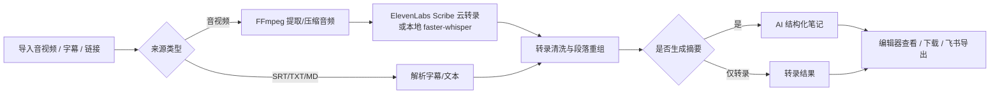

# FluentFlow 产品概览

## 一句话定位

FluentFlow 是一个面向长视频课程、课堂录音、讲座录音和已有字幕的 AI 笔记工作流工具，把“导入材料 -> 转写/整理字幕 -> 生成结构化学习笔记 -> 下载或导出飞书”集中在一个产品里。

它不是单纯的语音转文字工具。真正解决的问题是：课程和讲座材料从音视频变成可复习、可归档、可继续编辑的结构化笔记时，中间存在太多工具跳转、复制粘贴、等待不可见和格式整理成本。

## 目标用户

当前最适合：

- 高频处理课程视频、课堂录音和讲座录音的学生和研究生。
- 需要把长材料沉淀到飞书知识库的知识工作者。
- 有一批音视频或字幕资料，希望快速变成结构化笔记的人。

暂时不优先服务：

- 专业字幕制作团队。
- 需要多人实时协作编辑的团队。
- 对音视频资产管理、权限审批、审计合规有强需求的企业。
- 希望产品替代完整知识库、网盘或在线剪辑工具的用户。

## 核心问题

传统流程通常是：

1. 用剪映、播放器或其他工具提取字幕。
2. 把字幕复制给大模型。
3. 反复要求模型整理成笔记。
4. 再复制到飞书或本地文档。
5. 手动整理格式、标题、段落和归档位置。

这条链路的问题：

- 工具割裂：转录、摘要、文档归档分散在多个平台。
- 等待不可见：长音频转录时很难判断是否卡死。
- 长内容容易漏：直接把长字幕丢给模型，常出现选择性概括。
- 字幕格式不适合笔记：SRT/VTT 的时间码和碎片行会干扰模型理解。
- 修改容易丢：人工修转录稿如果只在前端状态里，刷新或重跑会浪费劳动。
- 数据不可证明：只知道“用过很多次”，但无法回溯效率、稳定性和失败原因。

## 核心流程

## 当前已支持

### 输入

- 本地视频/音频上传。
- SRT、VTT、TXT、MD 等字幕或文本导入。
- 抖音分享文本或视频链接解析。
- 多文件后台队列。

### 转录

- ElevenLabs Scribe 云转录。
- 本地 faster-whisper。
- FFmpeg 音频预处理。
- 本地 STT 子进程可取消。
- 云端 STT 阶段展示真实等待状态，不伪造百分比。
- 说话人区分按 provider 分流：本地使用 pyannote，云端使用 provider 返回的 speaker 标签。

### 文本整理

- SRT/VTT 时间码剥离。
- 字幕碎片按内容重组为更适合 AI 的正文。
- 明显重复幻觉清洗。
- 原始转录和清洗后文本保留不同口径。
- 转录结果可编辑并自动保存。
- 修改记录可沉淀为 STT 评估资产。

### AI 笔记

- DeepSeek / OpenAI 兼容摘要接口。
- 课程笔记、讲座笔记、研究摘要、快速要点、自定义提示词。
- 自动选择、直接长上下文、高保真笔记三种模式。
- 长材料可走分段证据提取和终稿生成，降低漏点风险。

### 导出

- 下载 TXT、SRT、VTT、Markdown、PDF、Word 等产物。
- 自动或手动导出飞书。
- 任务完成后可从历史任务重新打开结果。

### 数据

- SQLite 任务历史。
- SQLite 事件日志。
- 历史快照报告。
- STT 性能报告。
- 按账号或设备隔离任务历史。

## 当前非目标

这些不是当前阶段要解决的问题：

- 不做完整在线剪辑。
- 不做专业字幕压轴、断句、美化和双语字幕排版。
- 不做多人实时协同编辑。
- 不做 SaaS 级计费、套餐和组织权限。
- 不把“导出飞书”解释成“用户认可笔记质量”。
- 不把“用户修改转录稿”解释成“校对完成”，除非未来有明确校对入口。
- 不把本地设备上的 STT 速度包装成所有设备都能达到的速度。

## 产品判断

当前产品最重要的判断不是“还能加什么功能”，而是：

1. 外部用户能否独立跑通完整链路。
2. 长音视频等待体验是否足够可理解。
3. 转录稿可编辑和自动保存是否保护了用户劳动。
4. 长字幕笔记质量是否优于直接把 SRT 丢给模型。
5. 真实任务数据能否支撑效率、稳定性和导出成功率表达。

因此接下来的优化优先级应该是：

1. 公开试用稳定性。
2. 用户反馈记录。
3. ElevenLabs 云端转录稳定性与额度/失败提示。
4. 笔记质量测试计划。
5. 最小质量反馈入口。

## 项目叙事口径

简历或作品集里可以这样概括：

> FluentFlow 是一个 AI 视频课程笔记工作流工具，整合音视频/字幕导入、ElevenLabs 云端转写、本地应急转写、长文本结构化笔记生成和飞书导出，解决长视频学习资料整理中多工具跳转、等待不可见、格式整理和归档成本高的问题。

更偏产品验证时：

> 项目通过 SQLite 事件日志、历史快照和 STT 性能报告记录真实处理规模、阶段耗时、失败原因和导出结果，并按本地设备与云转录 provider 区分性能口径，避免将单一设备表现误包装为产品普遍表现。
